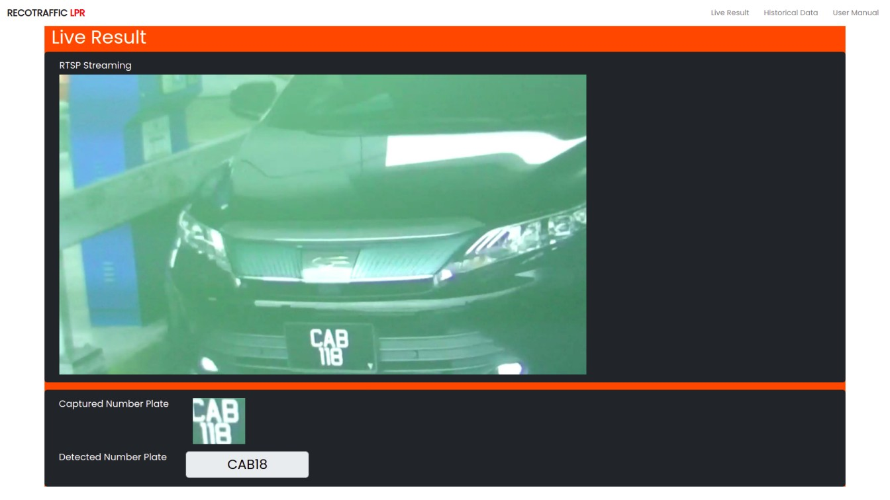
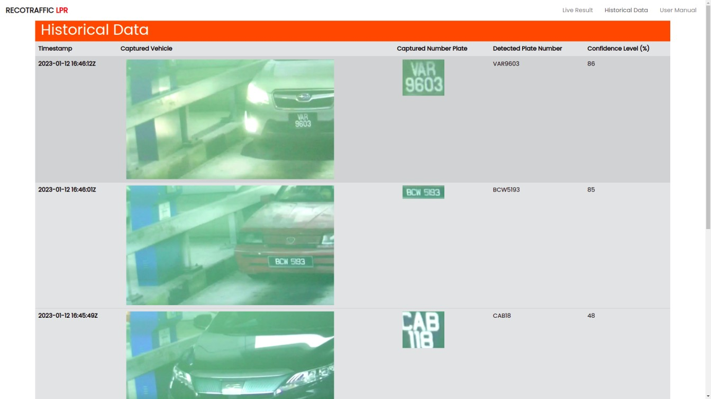

# ANPR Demographic Page

A demographic page to serve ANPR real time result




**Table of content**

- [1. Getting Started](#1-getting-started)
  - [1.1. Setup share folder](#11-setup-share-folder)
  - [1.2. Run a backend service](#12-run-a-backend-service)
  - [1.3. Run the frontend service](#13-run-the-frontend-service)
  - [1.4. Check the server webpage](#14-check-the-server-webpage)
- [2. Docker](#2-docker)
  - [2.1. Build the docker images](#21-build-the-docker-images)
  - [2.2. Configure the docker compose](#22-configure-the-docker-compose)
  - [2.3. Run the docker container](#23-run-the-docker-container)
- [3. Technical Specification](#3-technical-specification)
  - [3.1. Hardware Specification](#31-hardware-specification)
  - [3.2. Supported Web Browser](#32-supported-web-browser)
- [4. Software Specification (NPM libraries)](#4-software-specification-npm-libraries)
  - [4.1. Front-End](#41-front-end)
  - [4.2. Back-End](#42-back-end)
- [5. Todo](#5-todo)
- [6. FAQ](#6-faq)

## 1. Getting Started

### 1.1. Setup share folder

#### 1.1.1. Setup share folder (window)

1. Press `Win Key + R` to open run command. Type `\\172.17.0.143\anpr`
2. Enter the correct username and password

> Note: You might want to configure the backend environment variable `REACT_APP_DATA_PARENT_DIR` in `docker-compose.yml` to point to the correct path.

### 1.2. Setup share folder (linux)

1. Create a folder with the following command `sudo mkdir -p /mnt/anpr`
2. Open `fstab` with the command `sudo nano /etc/fstab`, then insert the following lines at the end of the file

   ```sh
   #anpr sharefolder
   //172.17.0.143/anpr  /mnt/anpr  cifs  username=rnd,password=recogine,uid=1000,gid=1000,iocharset=utf8,x-systemd.mount-timeout=10,x-systemd.device-timeout=10  0  0

   ```

3. Mount the server share folder with `sudo mount -a`

### 1.3. Run a backend service

1. Open current folder from a terminal, type the following to run the service:

   ```sh
   cd backend/
   npm ci
   npm start
   ```

### 1.4. Run the frontend service

1. Open current folder from a new terminal, type the following to run the service:

   ```sh
   cd frontend/
   npm ci
   npm start
   ```

### 1.5. Check the server webpage

Open <http://localhost:3000> to check the webpage.

<!--
### 1.5. Additional detailed guide

**Step 1**
a. Open Terminal
b. Type in **node index.js**
> **Note:** If *index.js* is not running, type  **npm ci**  and repeat **Step 1.b.**

**Step 2**
a. Open Terminal
b. Type in **cd client**
c. After working directory updated, type in **npm start**
> **Note:** If npm is not running, type  **npm ci**  and repeat **Step 1.c.**

**Step 3**
*only if real time streaming is unavailable*
a. Search *'mnt/anpr'* in '/' folder
b. Open Terminal
c. Type in **mkdir /mnt/anpr**
d. Open another Terminal
e. Type in **sudo nano /etc/fstab**
f. After entering NANO GNU text editor, type in `#anpr sharefolder
//172.17.0.143/anpr  /mnt/anpr  cifs  username=rnd,password=recogine,uid=1000,gid=1000,iocharset=utf8,x-systemd.mount-timeout=10,x-systemd.device-timeout=10  0  0`
g. Type **sudo mount -a** -->

## 2. Docker

To deploy a docker image, you will need to build the docker image first, follow by configure the docker compose parameter to run the docker container as the backend service.

### 2.1. Build the docker images

To build the backend docker image:

```sh
docker build -t recogine/recocloud:backend-v0.1.0-deploy backend/
```

To build the frontend docker image

```sh
docker build -t recogine/recocloud:frontend-v0.1.0-deploy frontend/
```

### 2.2. Configure the docker compose

There are few things neew to be configure in docker compose before running.

sample of docker-compose.yml:

```yaml docker-compose.yml
services:
  backend:
    image: recogine/recocloud:backend-v0.1.0-deploy
    ...
    volumes:
      - /mnt/anpr:/mnt/anpr:ro
    ...

  frontend:
    image: recogine/recocloud:frontend-v0.1.0-deploy
    environment:
      REACT_APP_MQTT_SERVER: "ws://172.17.0.216:8080/"
      REACT_APP_MQTT_DATA_TOPIC: "offloader/COM143/01/data"
      REACT_APP_BACKEND_FILE_SERVER: "http://172.17.11.2:4567/"
    ...
```

- **services/backend/image**: Change to your corresponding docker image name and tag number.
- **services/frontend/image**: Change to your corresponding docker image name and tag number.
- **services/backend/volumes**:
  - **`/mnt/anpr:/mnt/anpr:ro`**: The path of the offloader save vehicle image. The syntax is `/PATH/TO/ANPR/DATA:/mnt/anpr:ro`, while the path is the dir that included `data` dir in it. For example the offloader vehicle data is store in `/mnt/hdd/home/rnd/anpr`, then your valie should be look like `/mnt/hdd/home/rnd/anpr:/mnt/anpr:ro`
- **services/frontend/environment**:
  - **`REACT_APP_MQTT_SERVER`**: The mqtt server that the offloader pump into, usually will be current server. Syntax is `ws://SERVER_IP:8080/`, while `SERVER_IP` is the mqtt server ip. For example if the current server ip is `192.0.23.145`, then your valie should be like `ws://192.0.23.145:8080/`. Do not use `localhost` as the `SERVER_IP` if mqtt server on local machine, use mahine ip address instead.
  - **`REACT_APP_MQTT_DATA_TOPIC`**: The data topic to subscribe offloader data. Syntax is `offloader/`
  - **`REACT_APP_BACKEND_FILE_SERVER`**: The server that host the offloader image data, usually will be current server. Syntax is `http://SERVER_IP:4567/`. For example if the current server ip is `192.0.23.145`, then your valie should be like `http://SERVER_IP:4567/`. Do not use `localhost` as the `SERVER_IP` if file server on local machine, use mahine ip address instead.
- services/backend/volumes:

### 2.3. Run the docker container

---

## 3. Technical Specification

### 3.1. Hardware Specification
<!-- ### Device Requirements -->
### 3.2. Supported Web Browser

- Firefox
- Google Chrome

## 4. Software Specification (NPM libraries)

### 4.1. Front-End

- fontsource/poppins@4.5.10
- testing-library/jest-dom@5.16.5
- testing-library/react@13.4.0
- testing-library/user-event@13.5.0
- bootstrap@5.2.3
- mqtt@4.3.7
- react-dom@18.2.0
- react-router-dom@6.4.4
- react-scripts@5.0.1
- react@18.2.0
<!-- - web-vitals@2.1.4 -->
<!-- - opencv-react@0.0.5 -->

### 4.2. Back-End

- cors@2.8.5
- express@4.18.2

## 5. Todo

- [ ]

## 6. FAQ
